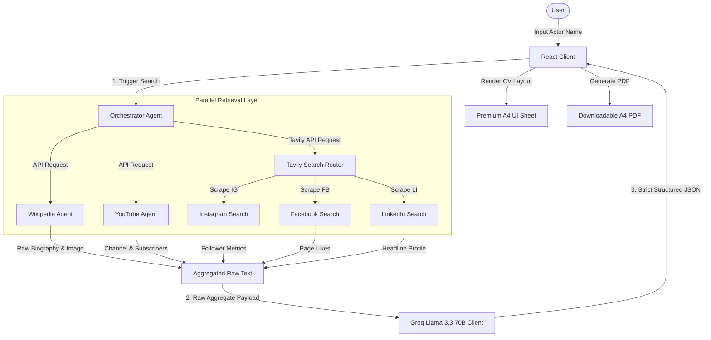

# StarCV

### Live Demo: [https://star-cv-txoq.vercel.app](https://star-cv-txoq.vercel.app)

StarCV is a premium, high-fidelity portfolio and resume compiler tailored for the Indian film industry. By executing concurrent search agents across **Wikipedia, YouTube, Instagram, Facebook, and LinkedIn**, StarCV aggregates biographical details, social presence metrics, and film credits in parallel, then synthesizes them using **Groq (Llama 3.3 70B)** into a print-ready, single-page A4 CV.

The application features a sleek, editorial aesthetic, supporting persistent **Light & Dark Themes** and high-resolution **A4 PDF Exporting**.

---

## System Architecture



---

## Key Features

* **Concurrently Aggregated Profiles**: Queries **Wikipedia, YouTube, Instagram, Facebook, and LinkedIn** simultaneously via Tavily & Google APIs, building complete CV aggregates in **under 5 seconds**.
* **Llama-Powered Schema Synthesis**: Uses Groq Llama 3.3 70B to parse raw data, cleaning out corporate resume jargon in favor of industry-appropriate terms (*Artist Profile*, *Selected Filmography*, *Special Skills*, *Awards & Accolades*).
* **Double-Theme Premium Design**:
  * **Dark Mode**: A luxurious, warm Obsidian and Matte Gold carbon design with glassmorphic elements.
  * **Light Mode**: A clean, print-perfect Ivory and Matte Bronze layout ideal for physical casting submissions.
* **Seeded Autocomplete**: A curated autocomplete search bar matching popular actors across Indian film industries for instant lookup.
* **Tainted-Canvas Safe PDF Export**: Configured with canvas cross-origin fallbacks to download crisp, high-resolution A4 PDFs without security breaks.

---

## Tech Stack

* **Frontend**: React.js, Vite
* **Styling**: Pure CSS3 Custom Theme System (Warm Obsidian/Gold & Ivory/Bronze)
* **Search Routing & APIs**:
  * **Tavily Search API**: Co-ordinates and routes query agents to scrape Instagram, Facebook, and LinkedIn profiles in parallel.
  * **Wikipedia Open API**: Sourced for biographical context and fallback images.
  * **YouTube Data API v3**: Sourced for active videos and subscriber counts.
* **LLM Engine**: Groq Cloud API (`llama-3.3-70b-versatile`)
* **PDF Engine**: `html2canvas` & `jspdf`

---

## Local Quick Start

### 1. Configure Environment Keys
Create a `.env` file in the root directory and supply your API keys:

```env
# Groq API Key (https://console.groq.com)
VITE_GROQ_API_KEY=your_groq_api_key_here

# Tavily API Key (https://tavily.com)
VITE_TAVILY_API_KEY=your_tavily_api_key_here

# YouTube Data API v3 Key (https://console.cloud.google.com)
VITE_YOUTUBE_API_KEY=your_youtube_api_key_here
```

> Security Warning: The `.env` file is excluded from git tracking in `.gitignore` to prevent credentials from being leaked to repositories.

### 2. Install Dependencies
```bash
npm install
```

### 3. Launch Development Server
```bash
npm run dev
```
Open [http://localhost:5173/](http://localhost:5173/) in your web browser.

---

## License
This project is open-source and available under the [MIT License](LICENSE).
